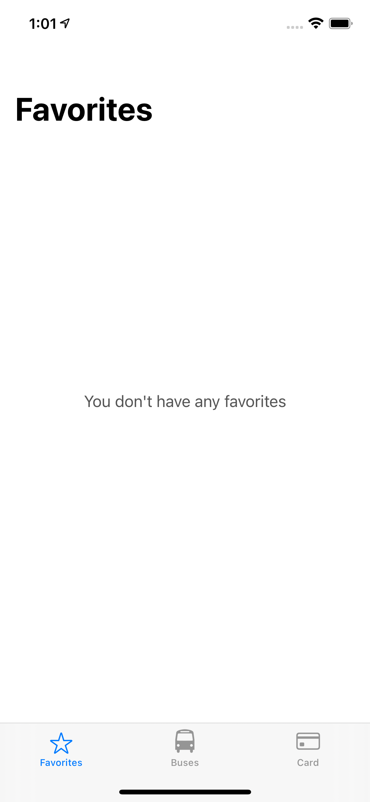
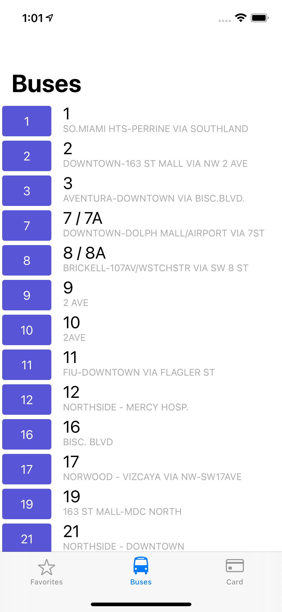
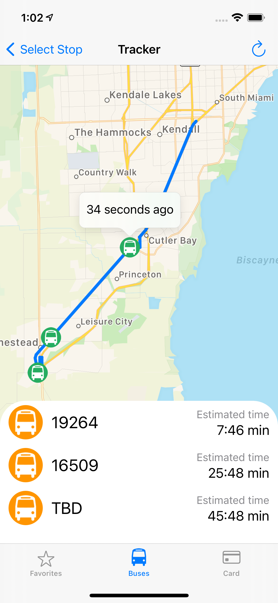
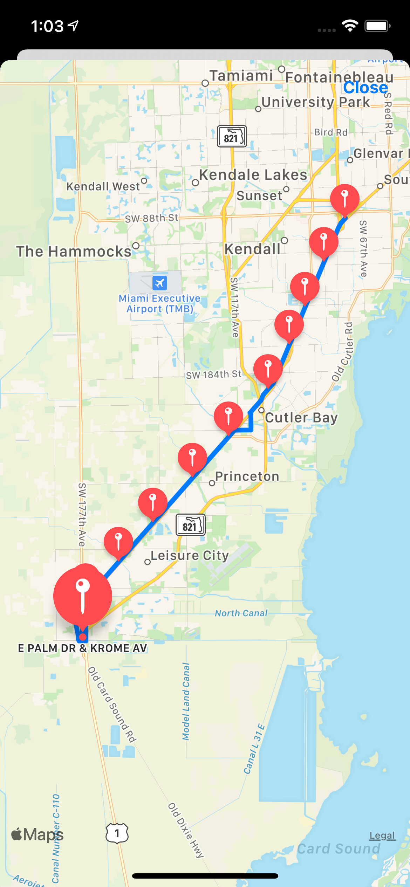
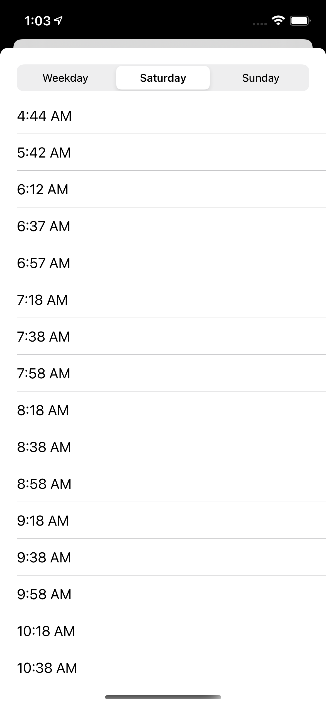
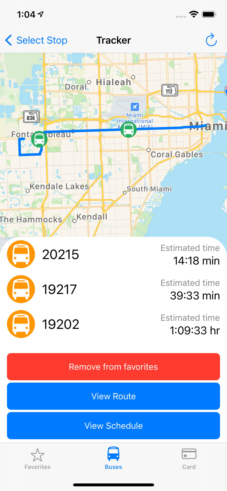
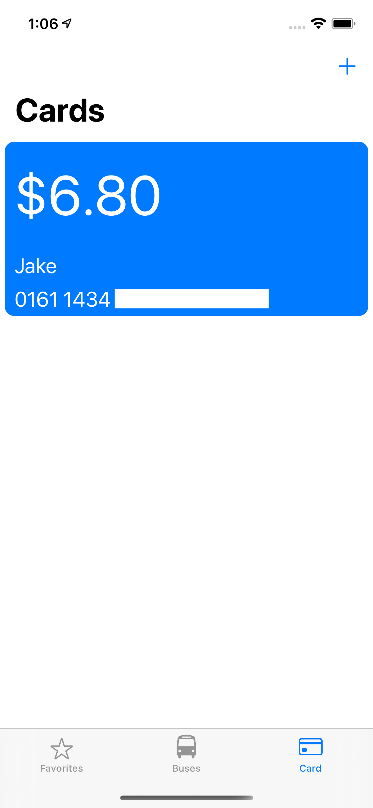

#  A lightweight bus tracker app for the Miami-Dade Transit System
Built in Swift, this app features a favorites page, real-time bus location and ETA, useful route information, and EASY Card integration.

## Screenshots:

  &nbsp;
  &nbsp;
  &nbsp;
  &nbsp;
  &nbsp;
  &nbsp;
  &nbsp;

